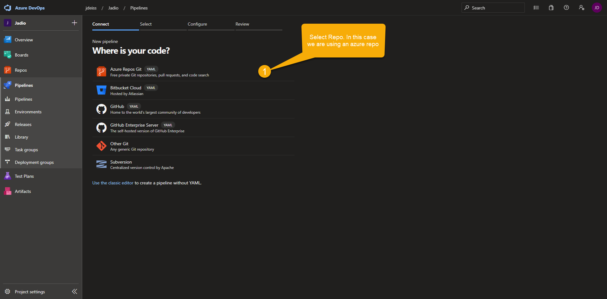
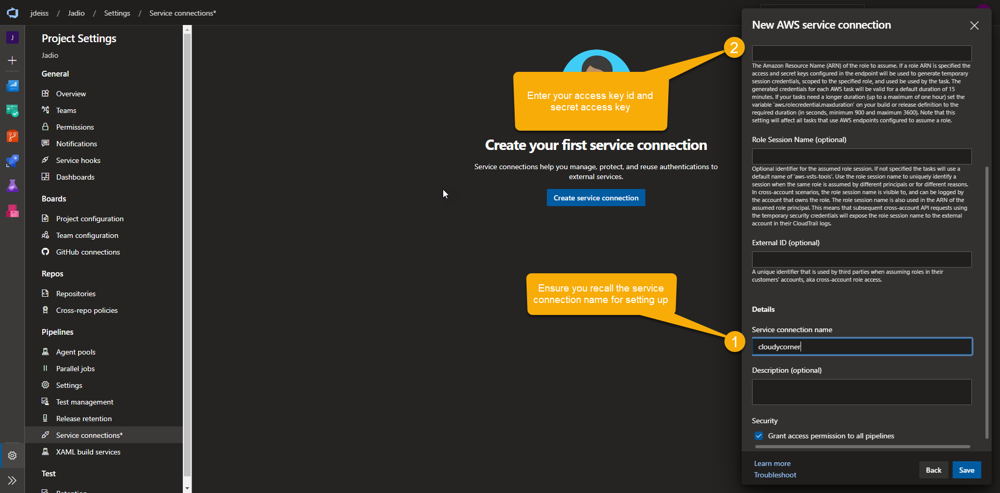

# Serverless Web App Hosted on AWS Starter Kit

## Intention

- Enable anyone to launch and begin developing a web app
- Includes an Azure pipeline which will deploy the front-end to an S3 bucket and create the following AWS services:
  - S3 Deployment bucket
  - Cloudfront Distribution to serve the web-app deployed in the S3 deployment bucket
  - API gateway
  - Sample Lambda Function

# Getting Started - Installing dependencies locally

1. Install Node.js (https://nodejs.org/en/download/)
2. Install Python (https://www.python.org/downloads/ ensure you add Python to PATH)
3. Install Serverless (Serverless guide: https://serverless-stack.com/)
```bash
npm install -g serverless
```

# Getting Started - Front-end

Replace the sample web app in the frontend folder with yours, or use the provided starter.

If you add your own frontend application, make sure to replace the *sourceFolder* parameter in azure-pipelines.yaml to match your build folder.

The starter project was taken from the Git project (https://github.com/tomastrajan/angular-ngrx-material-starter) and includes an Angular 8 starter with material ui library

1. Go to project folder (frontend/sample-web-app-angular-material) and install dependencies:
```bash
npm install
```

2. Launch development server, and open `localhost:4200` in your browser:
```bash
npm start
```

# Getting Started - Back-End

## 1. Update project settings in serverless/serverless.common.yml

- projectCode: Create a project code (ensure that it will be unique as it affects S3 deployment bucket)
- webAppBucketName: defaults to projectCode-website

## 2. Deploying manually from local codebase

1. Go to root serverless project folder (serverless) and install dependencies:
```bash
npm install
```

2. To Deploy your serverless folderto AWS, ensure CLI credentials are installed locally or in pipeline and run the deployment command (modifying parameters as required):
```bash
serverless deploy --aws-profile namedAWSCredentials --region us-east-1 --stage dev
```

3. To add additional serverless projects, copy a sample serverless folder and add the deployment command to the project folder.

4. Note that the serverless project is broken up into multiple smaller projects to alleviate some issues with circular dependencies as well as circumvent the 200 resource limit on cloudformation which is also imposed on serverless.

## 3. Setting up Azure Pipeline for Deployment
### 3.1 Installing AWS Extensions in Azure

- Go to organisation settings (Fig. 1)
- Go to Extensions (Fig. 2)
- Browse the marketplace
- Install AWS extension, if you are not the organisational owner, they will be sent a request to approve the installation.


<p align=center> Figure 1: Azure Organisation Settings


<p align=center> Figure 2: AWS Toolkit Extension

### 3.2 Setting up the azure pipeline

For the pipeline to deploy, you will need to create a few pipeline variables:

- $(AWS_CREDENTIALS_PROFILE_NAME): The profile setup with your AWS credentials in Azure
- $(AWS_DEPLOYMENT_REGION): The region in which you want to deploy your web app
- $(AWS_DEPLOYMENT_BUCKET): The bucket that is created to deploy your web app - must match your web app bucket name *(webAppBucketName variable in serverless/resources/storage/serverless.yml)*.
- $(AWS_DEPLOYMENT_STAGE): The stage of your deployment
- $(CLOUDFRONT_SECRET): A secret that is included in cloudfront as well as the s3 bucket to secure the bucket and allow access only from CloudFront even though the bucket is public
- DEPLOYMENT_VERSION: Deployment version of the azure pipeline - can be used as a unique variable if required
Steps are as follows:


<p align=center> Step 1: Setup new pipeline


<p align=center> Step 2: Select repo provider


<p align=center> Step 3: Select repo


<p align=center> Step 4: Select existing yaml file


<p align=center> Step 5: Set path to pipeline yaml file


<p align=center> Step 6: Add environment variables


<p align=center> Step 7: Create new variable


<p align=center> Step 8: Add required variables as per details above


<p align=center> Step 9: Setup AWS service connection


<p align=center> Step 10: Add credentials and note profile name

# Serverless Deployment Policy

There is a sample deployment policy included that can be used to generate the credentials for the serverless deployment policy. This is a good starting point to develop a least priveledge deployment policy.

# Future Development

- Enable offline development and testing of lambda functions
- Improve sample lambda functions
- Add knowledge wiki
- Vet the sample front-end